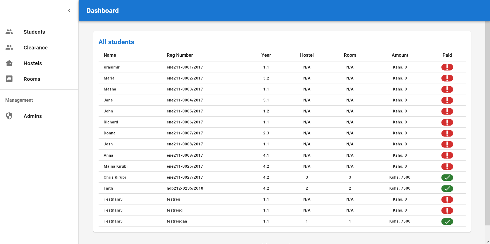
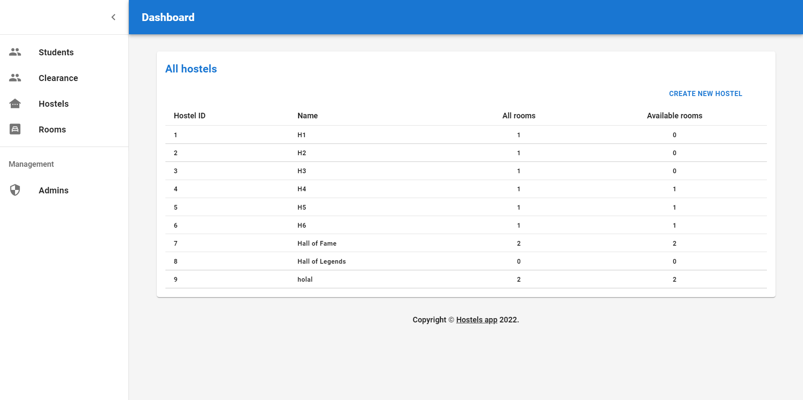
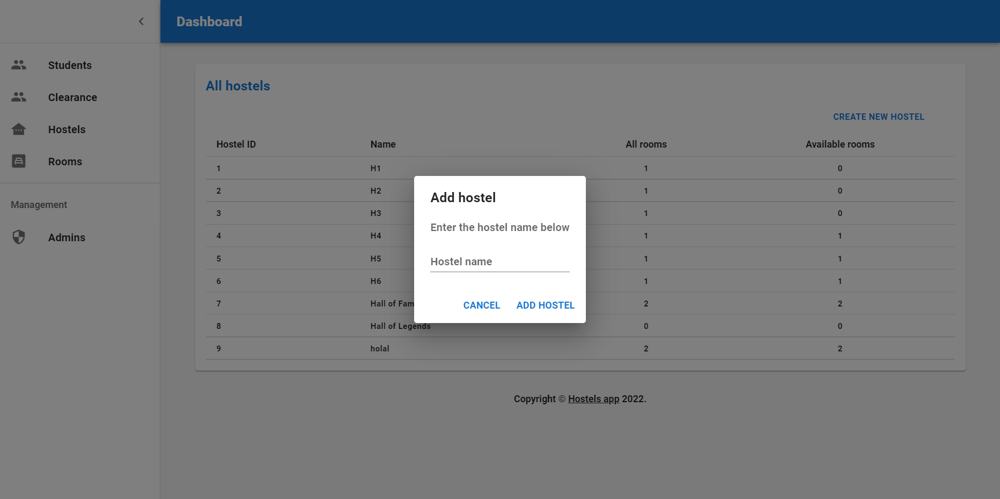
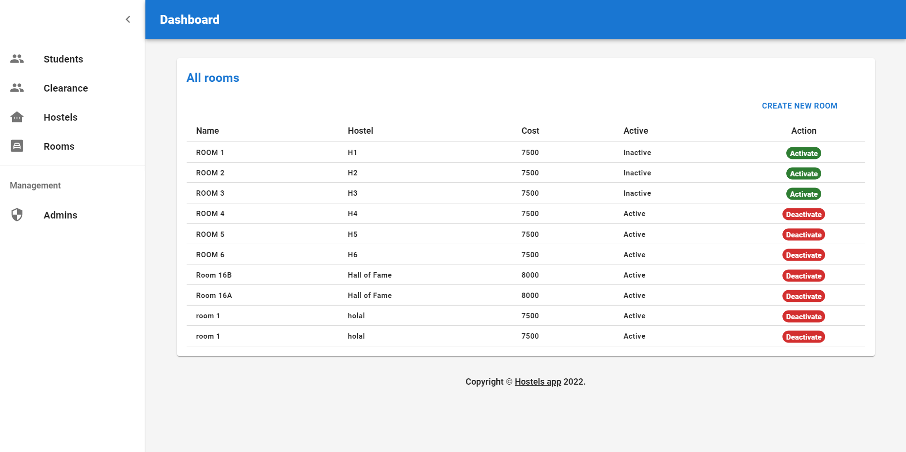
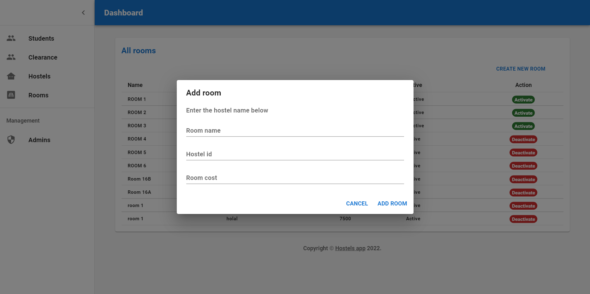

# Hostels app - web

Simple management panel for the hostel booking app.

Purpose - proof of concept & school project.

## Stack

Bootstrapped using [create-react-app](https://reactjs.org/docs/create-a-new-react-app.html)

Layout - [Material UI](https://mui.com)

## Related project

Associated android app (Flutter) - [here](https://github.com/murageh/hostels-app-android)

## Screenshot(s)

All students

All hostels

Add hostel

All rooms

Add room

`By Murageh - Feb 2022`